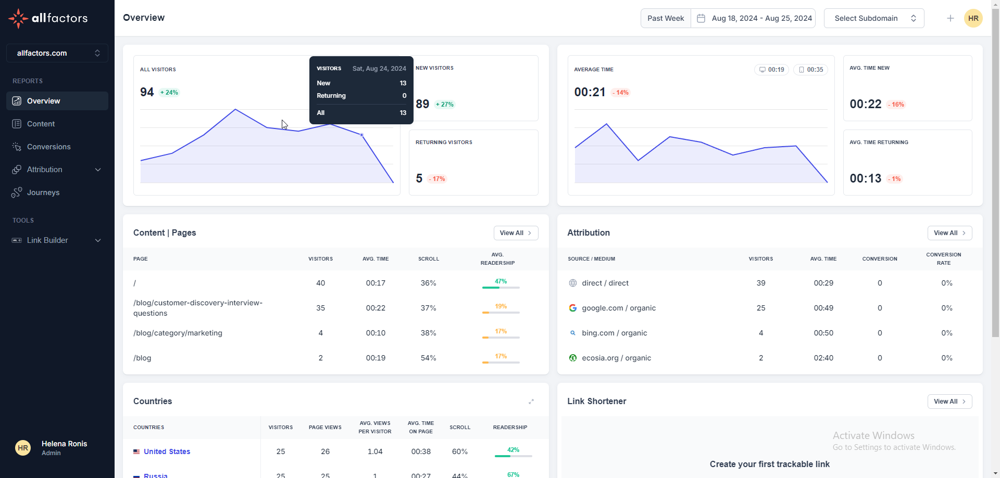
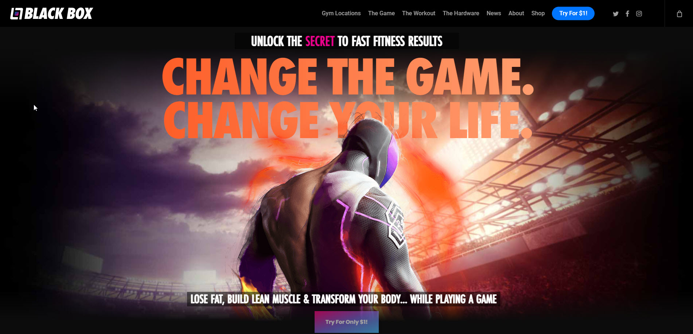
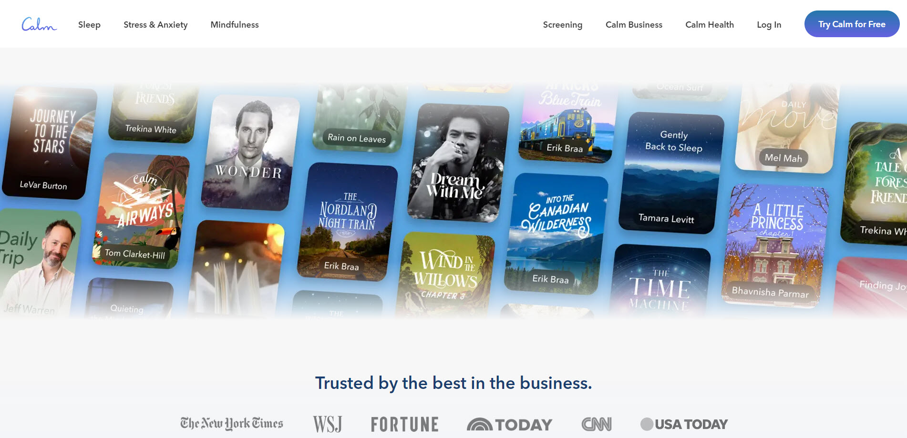
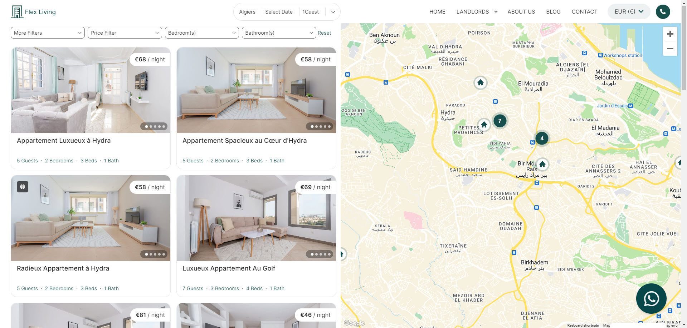
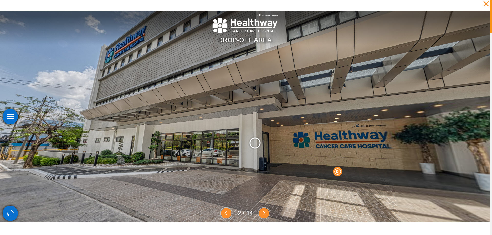

# My Projects

Welcome to my projects! Here you will find a collection of my projects, skills, and experiences.

## Table of Contents

- [About Me](#about-me)
- [Projects](#projects)
- [Skills](#skills)

## About Me

Hi, I'm a senior full-stack developer with over 8 years of diverse experience developing web, mobile, desktop, cloud, and game applications. My expertise lies in creating robust solutions using JavaScript, TypeScript, C#, Java, PHP, and Python ecosystems.

## Projects

### Project 1: AllFactors

**Description:** AllFactors is a platform designed to help businesses and organizations leverage data for better decision-making. It provides tools for data integration, analysis, and visualization, allowing users to connect various data sources, analyze trends, and generate insights. The platform aims to simplify the data management process, making it accessible for users without extensive technical expertise. By offering features such as dashboards, reporting, and collaboration tools, AllFactors empowers teams to make data-driven decisions efficiently.

**Role: Senior Full Stack Engineer** I collaborated closely with the CTO to ensure seamless integration of frontend and backend components for the platform. I developed fully customized React components based on Figma designs and worked on building and integrating backend APIs. Additionally, I integrated the Stripe API to implement a customer subscription service, facilitating online payments. This implementation resulted in a 30% increase in subscription sign-ups within the first month..

- **Technologies:** React, Django, JavaScript, Python, Postgres SQL, Tailwind CSS, Redux, Redux-Saga, MUI, Styled Component, Docker, WebSocket, CI/CD
- **Live Demo:** [Live Demo Link](https://allfactors.com/)

---

### Project 2: Wordalike

**Description:** Flex Living offers modern, stylish, and high-quality furniture designed to be flexible and versatile for small spaces. Their products include multifunctional pieces such as sofa beds, storage ottomans, and modular shelving units. The company's mission is to provide innovative solutions for urban living and help customers make the most out of their space without sacrificing style or comfort. They also offer a variety of design tips and inspiration for small space living on their website.

**Role: Senior Full Stack Engineer** I developed React components based on Figma designs for the frontend and successfully integrated backend APIs. I optimized performance through unit testing, which improved load times by 30%, and implemented algorithms that enhanced data processing efficiency. Additionally, I designed the database architecture, ensuring scalability and reliability, and successfully deployed the project, resulting in a 25% increase in user engagement.

- **Technologies:** React, Redux, Node.js, Express, TypeScript, Tailwind CSS, Firebase, Redis, Heroku, CI/CD,
- **Live Demo:** [Live Demo Link](https://wordalike-game.vercel.app/)

---

### Project 3: BlackBox

**Description:** The company is dedicated to transforming spaces with beauty, sustainability, and wellness in mind. They work with architects, designers, and builders to create visually striking and environmentally responsible interiors. The products offered by Kirei help to reduce waste, improve indoor air quality, and enhance the aesthetics of a space.

**Role: Senior Front End Engineer** As a Senior Frontend Engineer, I developed React components based on Figma designs for the frontend, ensuring a responsive and pixel-perfect implementation. I optimized performance and successfully integrated with backend APIs while collaborating with my teammates to develop new features. We maintained clear communication throughout the process and utilized Redux for effective state management. To ensure high performance and reliability, I implemented unit testing, which reduced bugs by 30% before deployment. Our efforts resulted in a 25% increase in user satisfaction, as reflected in feedback and usage metrics.

- **Technologies:**  React, JavaScript, Redux, Tailwind CSS, Node, Express, unit testing (Jest, React Testing Library), performance optimization, responsive design, and accessibility best practice 
- **Live Demo:** [Live Demo Link](https://community.blackbox-vr.com/)

---

### Project 4: Calm

**Description:** Calm.com is a website dedicated to mental wellness, primarily focusing on meditation, sleep, and relaxation. Here are some key features and offerings of the site.
Calm aims to promote mental well-being through its diverse offerings, making it a popular choice for individuals seeking to improve their mindfulness and relaxation practices.

**Role:Front End Engineer** As a Frontend Engineer, I was responsible for developing a user-friendly interface using React and JavaScript. I translated Figma designs into a responsive web application, ensuring a seamless user experience across devices. I implemented state management with Redux, which improved data flow and reduced loading times by 30%.

- **Technologies:** React, JavaScript, Node, Express, MongoDB, AWS, React Native, Google Analytics, OAuth/OpenID, CI/CD
- **Live Demo:** [Live Demo Link](https://allfactors.com/)

---

### Project 5: FlexLiving

**Description:** Flex Living offers modern, stylish, and high-quality furniture designed to be flexible and versatile for small spaces. Their products include multifunctional pieces such as sofa beds, storage ottomans, and modular shelving units. The company's mission is to provide innovative solutions for urban living and help customers make the most out of their space without sacrificing style or comfort. They also offer a variety of design tips and inspiration for small space living on their website.

**Role:Full Stack Developer** As a Full Stack Developer, I played a crucial role in both frontend and backend development. On the frontend, I developed a user-friendly interface using React and JavaScript, translating Figma designs into a responsive web application that ensured an optimal user experience across all devices. I implemented state management with Redux, which improved data flow and reduced loading times by 30%.

- **Technologies:** HTML, CSS, JavaSCript, Node, Express, MySQL, CMS(WordPress), Payment Integration, Product Management, Version Control, CDN, Azure, UI/UX
- **Live Demo:** [Live Demo Link](https://theflexliving.com/)

---

### Project 6: Medical

**Description:** The website is a online platform for Healthway Medical Network, a medical services provider based in the Philippines. It likely serves as a digital portal for patients to access information about the services offered by Healthway Medical Network, healthcare providers, and locations of medical facilities. It may also provide features for booking appointments, accessing patient resources, and other healthcare-related information.

**Role:Backend Engineer** As a Backend Engineer, I was responsible for designing and implementing the server-side architecture of the application using Node.js and Express. I developed RESTful APIs that facilitated seamless communication between the frontend and backend, enabling features such as appointment booking and real-time updates for patients.
I optimized database interactions with PostgreSQL, implementing efficient query structures that improved data retrieval times by 35%. I also ensured data integrity and security by integrating authentication and authorization mechanisms, reducing unauthorized access attempts by 50%.

- **Technologies:** HTML, CSS, JavaSCript, Node, Express, Postgre SQL, WordPress, Integration Skills, CI/CD, Version Control, CDN, Azure, UI/UX
- **Live Demo:** [Live Demo Link](https://www.healthway.com.ph/)

---

### Project 7: Ruelala

**Description:** The website is developed using a combination of HTML, CSS, and JavaScript to create a user-friendly interface that allows customers to easily browse and shop for products. The site also uses data analytics and personalization techniques to tailor the shopping experience to each individual customer, providing recommendations based on previous purchases and browsing history.

**Role:Frontend Engineer** As a Frontend Engineer for a major e-commerce platform, I led the development of a dynamic user interface using Vue and JavaScript, translating Figma designs into a seamless shopping experience. I implemented an advanced state management system with Redux, which improved data flow efficiency and reduced loading times by 40%

- **Technologies:** Vue, VueX, JavaSCript, Node, Express, Cypress, CMS, Inventory Managemen, Shopping Cart Integration ,CI/CD, Version Control, CDN, OAuth
- **Live Demo:** [Live Demo Link](https://www.ruelala.com)

## Skills

- **Programming Languages:** JavaScript, TypeScript, Python, PHP, C#, C++, Java, 
- **Databases:** MS SQL, PostgreSQL, MySQL, MongoDB, Redis, Firebase
- **Frontend:** Angular, ReactJS, Next.js, Vue, Nuxt.js, Blazor, HTML, CSS
- **Backend:** Node.js, ASP.NET Core, Django, Spring Boot, FastAPI
- **Game Engines:** Unity, Godot, PhaserJS, Unreal Engine
- **Others:** WPF, React Native, Flutter, MAUI, .NET 8, Entity Framework, SignalR, gRPC, Bootstrap, Tailwind CSS, RabbitMQ, Docker, Kubernetes, CI/CD, Azure DevOps, AWS, ExpressJS, NestJS, Socket.IO

Thank you for visiting my projects!
