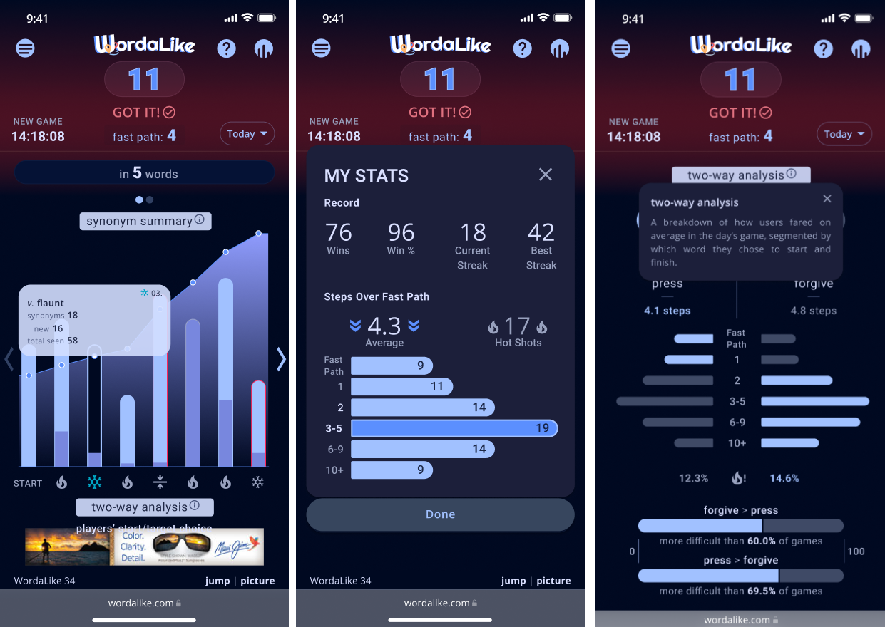
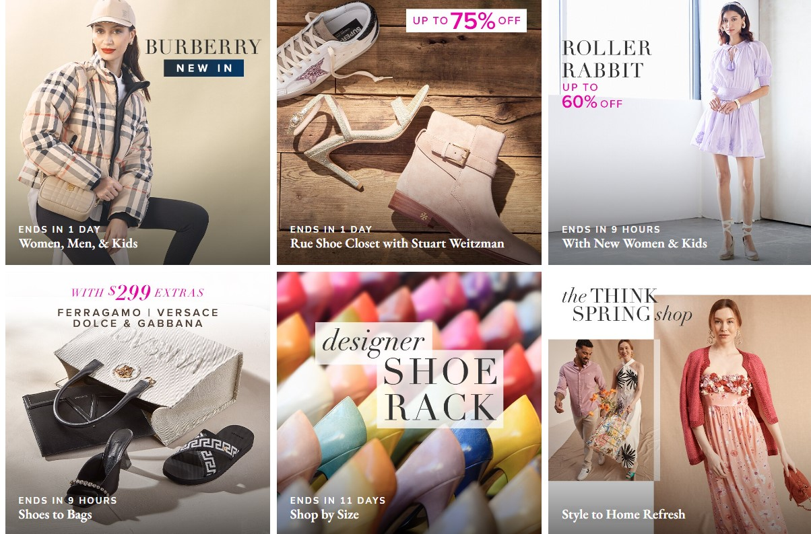

# My Projects

Welcome to my projects! Here you will find a collection of my projects, skills, and experiences.

## Table of Contents

- [About Me](#about-me)
- [Projects](#projects)
- [Skills](#skills)

## About Me

Hi, I'm a senior full-stack developer with over 8 years of diverse experience developing web, mobile, desktop, cloud, and game applications. My expertise lies in creating robust solutions using JavaScript, TypeScript, C#, Java, PHP, and Python ecosystems.

## Projects

### Project 1: AllFactors

**Description:** AllFactors is a platform designed to help businesses and organizations leverage data for better decision-making. It provides tools for data integration, analysis, and visualization, allowing users to connect various data sources, analyze trends, and generate insights. The platform aims to simplify the data management process, making it accessible for users without extensive technical expertise. By offering features such as dashboards, reporting, and collaboration tools, AllFactors empowers teams to make data-driven decisions efficiently.

- **Technologies:** React, Django, Redux, Redux-Saga, Tailwind CSS, Styled Component, Postgres, Docker, WebSocket, CI/CD
- **Live Demo:** [Live Demo Link](https://allfactors.com/)

---

### Project 2: Wordalike

**Description:** Flex Living offers modern, stylish, and high-quality furniture designed to be flexible and versatile for small spaces. Their products include multifunctional pieces such as sofa beds, storage ottomans, and modular shelving units. The company's mission is to provide innovative solutions for urban living and help customers make the most out of their space without sacrificing style or comfort. They also offer a variety of design tips and inspiration for small space living on their website.

- **Technologies:** React, Node.js
- **Live Demo:** [Live Demo Link](https://wordalike-game.vercel.app/)

---

### Project 3: BlackBox

**Description:** The company is dedicated to transforming spaces with beauty, sustainability, and wellness in mind. They work with architects, designers, and builders to create visually striking and environmentally responsible interiors. The products offered by Kirei help to reduce waste, improve indoor air quality, and enhance the aesthetics of a space.

- **Technologies:** Python, Flask
- **Live Demo:** [Live Demo Link](https://wordalike-game.vercel.app/)

---

### Project 4: FlexLiving

**Description:** Flex Living offers modern, stylish, and high-quality furniture designed to be flexible and versatile for small spaces. Their products include multifunctional pieces such as sofa beds, storage ottomans, and modular shelving units. The company's mission is to provide innovative solutions for urban living and help customers make the most out of their space without sacrificing style or comfort. They also offer a variety of design tips and inspiration for small space living on their website.

- **Technologies:** React, Node.js
- **Live Demo:** [Live Demo Link](https://theflexliving.com/)

---

### Project 5: Medical

**Description:** The website is a online platform for Healthway Medical Network, a medical services provider based in the Philippines. It likely serves as a digital portal for patients to access information about the services offered by Healthway Medical Network, healthcare providers, and locations of medical facilities. It may also provide features for booking appointments, accessing patient resources, and other healthcare-related information.

- **Technologies:** Python, Flask
- **Live Demo:** [Live Demo Link](https://www.healthway.com.ph/)

---

### Project 6: Ruelala

**Description:** The website is developed using a combination of HTML, CSS, and JavaScript to create a user-friendly interface that allows customers to easily browse and shop for products. The site also uses data analytics and personalization techniques to tailor the shopping experience to each individual customer, providing recommendations based on previous purchases and browsing history.

- **Technologies:** Python, Flask
- **Live Demo:** [Live Demo Link](https://www.ruelala.com)

## Skills

- **Programming Languages:** JavaScript, TypeScript, Python, PHP, C#, C++, Java, 
- **Databases:** MS SQL, PostgreSQL, MySQL, MongoDB, Redis, Firebase
- **Frontend:** Angular, ReactJS, Next.js, Vue, Nuxt.js, Blazor, HTML, CSS
- **Backend:** Node.js, ASP.NET Core, Django, Spring Boot, FastAPI
- **Game Engines:** Unity, Godot, PhaserJS, Unreal Engine
- **Others:** WPF, React Native, Flutter, MAUI, .NET 8, Entity Framework, SignalR, gRPC, Bootstrap, Tailwind CSS, RabbitMQ, Docker, Kubernetes, CI/CD, Azure DevOps, AWS, ExpressJS, NestJS, Socket.IO

Thank you for visiting my projects!
